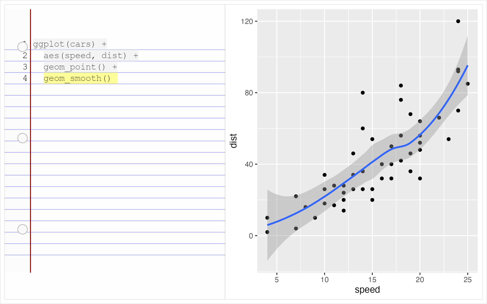

- [ggram](#ggram)
- [What’s inside:](#whats-inside)
- [`StatCode` & `StatCodeLineNumbers`](#statcode--statcodelinenumbers)
- [`code_file_to_code_df`](#code_file_to_code_df)
- [`stamp_notebook`](#stamp_notebook)
  - [ggram with patchwork](#ggram-with-patchwork)
- [Minimally package](#minimally-package)

<!-- README.md is generated from README.Rmd. Please edit that file -->

# ggram

<!-- badges: start -->

[](https://lifecycle.r-lib.org/articles/stages.html#experimental)
<!-- badges: end -->

`ggram` explores a code-output side-by-side for sharing bite-sized
how-tos. The specific motivation is to easily feature ggplot2 extenders
work - which so often *transform* user experience.

We’re in the proof-of-concept phase (expect fragility), but the idea is:

1)  clear history.
2)  execute plot code.
3)  combine plot code (new history) and plot output w/ patchwork (code
    just an annotation).

Thanks to [ggplot2 extenders
discussions](https://github.com/ggplot2-extenders/ggplot-extension-club/discussions/86)
for ideas - there are more ideas there that deserve further exploration
and may make the implementation better.

Install development version:

``` r
remotes::install_github("EvaMaeRey/ggram")
```

The following must be done in an interactive session:

``` r
library(ggplot2)
library(ggram)

ggram:::clearhistory() # you can do this in your IDE if you prefer

ggplot(cars) + 
  aes(speed, dist) + 
  geom_point() + 
  geom_smooth() #<<

ggram("This is a ggram") # this must be on a single line for arguments here (fragile! sorry!)
```


Notes: ggram::ggram() fails given the string replacement in the current
implementation…

``` r
clearhistory <- function() {
  
  temp <- tempfile()
  write("", file=temp)
  loadhistory(temp)
  unlink(".blank")
}
```

# What’s inside:

# `StatCode` & `StatCodeLineNumbers`

``` r

# readLines(temp) |> flipbookr:::code_parse()

#' @importFrom dplyr mutate group_by filter
#' @importFrom stringr str_remove str_split

compute_panel_code <- function(data, scales){
  
 data |>
    mutate(row = row_number()) |> 
    mutate(is_highlighted = str_detect(.data$code, "#<<")) |> 
    mutate(code = str_remove(.data$code, "#<<")) |>
    mutate(code = str_split(.data$code, "")) |>
    unnest(code) |>
    group_by(row) |> 
    mutate(x = row_number()) |>
    mutate(is_character = .data$code != " ") |>
    mutate(is_code = cumsum(.data$is_character) |> as.logical()) |>
    filter(.data$is_code) |>
    mutate(label = .data$code)
  
}

compute_panel_code_line_numbers <- function(data, scales){
  
 data |>
    mutate(row = row_number()) 
  
}

#' @importFrom ggplot2 ggproto aes after_stat Stat
StatCode <- ggproto("StatCode", Stat,
                    compute_panel = compute_panel_code,
                    default_aes = aes(fill = after_stat(is_highlighted),
                                      y = after_stat(row))
                    )

#' @importFrom ggplot2 ggproto aes after_stat Stat
StatCodeLineNumbers <- ggproto("StatCodeLineNumbers", Stat,
                    compute_panel = compute_panel_code_line_numbers,
                    default_aes = aes(y = after_stat(row),
                                      x = after_stat(-0.5),
                                      hjust = after_stat(1),
                                      label = after_stat(row))
                    )
```

# `code_file_to_code_df`

``` r
code_file_to_code_df <- function(filepath = ".Rhistory"){
  
  readLines(filepath) |> 
    paste(collapse = "\n") |> 
    stringr::str_remove("ggram\\(.+\\)|ggram\\(\\)") |>
    styler::style_text() |> 
    as.character() |>
    data.frame(code = _) 
  
}
```

``` r
code_file_to_code_df() |> 
  compute_panel_code()
#> # A tibble: 60 × 7
#> # Groups:   row [4]
#>    code    row is_highlighted     x is_character is_code label
#>    <chr> <int> <lgl>          <int> <lgl>        <lgl>   <chr>
#>  1 g         1 FALSE              1 TRUE         TRUE    g    
#>  2 g         1 FALSE              2 TRUE         TRUE    g    
#>  3 p         1 FALSE              3 TRUE         TRUE    p    
#>  4 l         1 FALSE              4 TRUE         TRUE    l    
#>  5 o         1 FALSE              5 TRUE         TRUE    o    
#>  6 t         1 FALSE              6 TRUE         TRUE    t    
#>  7 (         1 FALSE              7 TRUE         TRUE    (    
#>  8 c         1 FALSE              8 TRUE         TRUE    c    
#>  9 a         1 FALSE              9 TRUE         TRUE    a    
#> 10 r         1 FALSE             10 TRUE         TRUE    r    
#> # ℹ 50 more rows

code_file_to_code_df() |>
  ggplot() + 
  aes(code = code) + 
  geom_text(stat = StatCode) + 
  geom_tile(stat = StatCode, alpha = .2) + 
  scale_y_reverse()
```


# `stamp_notebook`

Only one style currently is supported for the code visual.

``` r

stamp_notebook <- function(){
  
  list(
    
    theme_void(),
    theme(plot.background = element_rect(fill = alpha("whitesmoke", .1))),
    scale_y_reverse(limits = c(-1, 20)),
    # coord_equal(),
    scale_x_continuous(limits = c(-3, 35)),
    annotate("rect", xmin = -Inf, xmax = 0, ymin = -Inf, ymax = Inf, 
             fill = alpha("grey90", .1)),
    geom_vline(xintercept = 0, color = "darkred") ,
    geom_hline(yintercept = 1:29 + .5, color = "blue", linewidth = .2, alpha = .5),
    NULL
  )
  
}

stamp_punched_holes <- function(){
  
   list(
    annotate("point", x = -1.5, y = c(1,9,17) + .25, color = "white", size = 5) ,
    annotate("point", x = -1.5, y = c(1,9,17) + .25, shape = 21, 
             alpha = .3, size = 5, fill = "grey92")
   )
  
}
```

## ggram with patchwork

``` r
#' @export
ggram <- function(title = NULL, widths = c(1,1), ...){
  
  temp <- tempfile()
  savehistory(file = ".Rhistory")

  plot <- last_plot()
  
  code_file_to_code_df() |>
  ggplot() +
    aes(code = code) +
    stamp_notebook() +
    geom_tile(stat = StatCode) + 
    scale_fill_manual(values = c(alpha("grey90",.4), alpha("yellow", .4)), 
                      breaks = c(FALSE, TRUE)) +
    geom_text(stat = StatCode, alpha = .7, family = "mono") +
    geom_text(stat = StatCodeLineNumbers, family = "mono") +
    theme(legend.position = "none") + 
    stamp_punched_holes() +
    NULL ->
  code_plot
  
  code_plot + plot + patchwork::plot_layout(widths = widths) +
    patchwork::plot_annotation(title = title, ...) & 
    theme(plot.background = element_rect(colour = "black", linewidth = .05))
  
}
```

``` r
clearhistory()

ggplot(cars) + 
  aes(speed, dist) + 
  geom_point() + 
  geom_smooth() #<<

ggram()

ggsave(filename = "a_ggram.png", width = 8, height = 5)
```

``` r

```


# Minimally package

``` r
devtools::create(".")
```

``` r
usethis::use_package("ggplot2")
usethis::use_package("patchwork")
usethis::use_package("stringr")
usethis::use_package("styler")
usethis::use_package("dplyr")


# knitrExtra::chunk_names_get()
knitrExtra::chunk_to_dir(c("clearhistory", "StatCode", "stamp_notebook", "ggram", "code_file_to_code_df"))
```

``` r
devtools::check(".")
devtools::install(pkg = ".", upgrade = "never") 
```
