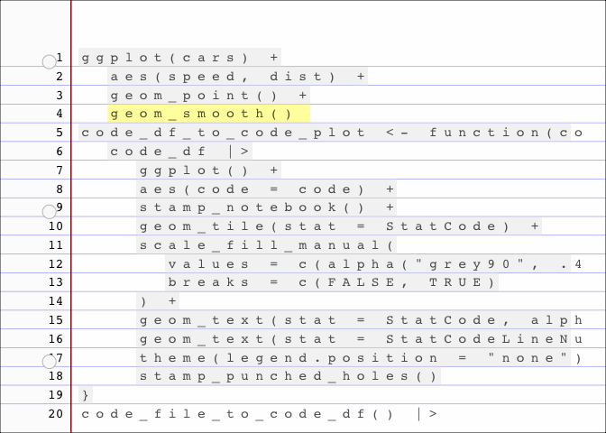

- [ggram](#ggram)
- [What’s inside:](#whats-inside)
  - [`StatCode` & `StatCodeLineNumbers` parse code for disply on a
    ggplot](#statcode--statcodelinenumbers-parse-code-for-disply-on-a-ggplot)
  - [`code_file_to_code_df` parses code or code file to a
    dataframe](#code_file_to_code_df-parses-code-or-code-file-to-a-dataframe)
  - [`stamp_notebook` contains instructions for stamping down a notebook
    paper
    look](#stamp_notebook-contains-instructions-for-stamping-down-a-notebook-paper-look)
- [Styling aspiration, not exported, for graph-side
  (right-hand-side)](#styling-aspiration-not-exported-for-graph-side-right-hand-side)
  - [`code_df_to_code_plot()` prepares
    df](#code_df_to_code_plot-prepares-df)
  - [`ggram:::clearhistory()` lets you clear your history using code,
    but you can also do this in your
    IDE](#ggramclearhistory-lets-you-clear-your-history-using-code-but-you-can-also-do-this-in-your-ide)
  - [`ggram()` and friends assemble meta plots containing a plot that
    shows code and the output, stitched together with
    patchwork](#ggram-and-friends-assemble-meta-plots-containing-a-plot-that-shows-code-and-the-output-stitched-together-with-patchwork)
    - [helpers](#helpers)
    - [user-facing ggram and friends](#user-facing-ggram-and-friends)
- [example with retheming…](#example-with-retheming)
- [Minimally package](#minimally-package)

<!-- README.md is generated from README.Rmd. Please edit that file -->

# ggram

<!-- badges: start -->

[](https://lifecycle.r-lib.org/articles/stages.html#experimental)
<!-- badges: end -->

`ggram` explores a method for creating a *quick* code-output
side-by-side for sharing bite-sized how-tos. The specific motivation is
to easily feature ggplot2 extenders work - which so often *transform*
user experience.

We’re in the proof-of-concept phase (expect fragility), but the idea is:

0)  write some amazing plot code
1)  copy the code you would like to quote
2)  combine plot code (copied) and plot output w/ patchwork (code just
    an annotation).

Thanks to [ggplot2 extenders
discussions](https://github.com/ggplot2-extenders/ggplot-extension-club/discussions/86)
for ideas - there are more ideas there that deserve further exploration
and may make the implementation better.

Install development version:

``` r
remotes::install_github("EvaMaeRey/ggram")
```

The following should be done in an interactive session:

``` r
library(ggram)

library(ggplot2)
#
ggplot(cars) + 
  aes(speed, dist) + 
  geom_point() + 
  geom_smooth() #<<

ggram("This is a ggram.") # this must be on a single line at this early development stage.
```


Notes: ggram::ggram() fails given the string replacement in the current
implementation…

``` r
library(tidyverse)
```

# What’s inside:

## `StatCode` & `StatCodeLineNumbers` parse code for disply on a ggplot

<details>

``` r

# readLines(temp) |> flipbookr:::code_parse()

#' @importFrom dplyr mutate group_by filter row_number
#' @importFrom stringr str_remove str_split str_detect
#' @importFrom tidyr unnest

compute_panel_code <- function(data, scales){
  
 data |>
    mutate(row = row_number()) |> 
    mutate(is_highlighted = str_detect(.data$code, "#<<")) |> 
    mutate(code = str_remove(.data$code, "#<<")) |>
    mutate(code = str_remove(.data$code, "^#$")) |>
    mutate(code = str_split(.data$code, "")) |>
    unnest(code) |>
    group_by(row) |> 
    mutate(x = row_number()) |>
    mutate(is_character = .data$code != " ") |>
    mutate(is_code = cumsum(.data$is_character) |> as.logical()) |>
    filter(.data$is_code) |>
    mutate(label = .data$code)
  
}

compute_panel_code_line_numbers <- function(data, scales){
  
 data |>
    mutate(row = row_number()) 
  
}

#' @importFrom ggplot2 ggproto aes after_stat Stat
StatCode <- ggproto("StatCode", Stat,
                    compute_panel = compute_panel_code,
                    default_aes = aes(fill = after_stat(is_highlighted),
                                      y = after_stat(row))
                    )

#' @importFrom ggplot2 ggproto aes after_stat Stat
StatCodeLineNumbers <- ggproto("StatCodeLineNumbers", Stat,
                    compute_panel = compute_panel_code_line_numbers,
                    default_aes = aes(y = after_stat(row),
                                      x = after_stat(-0.5),
                                      hjust = after_stat(1),
                                      label = after_stat(row))
                    )
```

</details>

``` r
# for demo purposes only
create_plot_code <- function(){
  
"library(ggplot2)

ggplot(cars) +
  aes(speed, dist) #<< + 
  geom_point()"

  }


code_to_vector <- function(code){
  
  if(code |> is.null()){NULL}else{str_split(code, "\\n")[[1]]}
  
}
```

``` r
create_plot_code() |> 
  code_to_vector()
#> [1] "library(ggplot2)"          ""                         
#> [3] "ggplot(cars) +"            "  aes(speed, dist) #<< + "
#> [5] "  geom_point()"
```

## `code_file_to_code_df` parses code or code file to a dataframe

``` r
code_file_to_code_df <- function(code = NULL, filepath = ".Rhistory"){
  
  code_vector <- code |> code_to_vector()
  code_vector <- code_vector %||% clipr::read_clip()
  
  code_vector |> 
    # styler::style_text() |> 
    as.character() |>
    data.frame(code = _) #|>
    # filter(!stringr::str_detect(code, "^ggram.+"))
  
}
```

``` r
# ggram:::clearhistory()

ggplot(cars) + 
  aes(speed, dist) + 
  geom_point()
```


``` r

create_plot_code() |>
code_file_to_code_df() |> 
  compute_panel_code()
#> # A tibble: 62 × 7
#> # Groups:   row [4]
#>    code    row is_highlighted     x is_character is_code label
#>    <chr> <int> <lgl>          <int> <lgl>        <lgl>   <chr>
#>  1 l         1 FALSE              1 TRUE         TRUE    l    
#>  2 i         1 FALSE              2 TRUE         TRUE    i    
#>  3 b         1 FALSE              3 TRUE         TRUE    b    
#>  4 r         1 FALSE              4 TRUE         TRUE    r    
#>  5 a         1 FALSE              5 TRUE         TRUE    a    
#>  6 r         1 FALSE              6 TRUE         TRUE    r    
#>  7 y         1 FALSE              7 TRUE         TRUE    y    
#>  8 (         1 FALSE              8 TRUE         TRUE    (    
#>  9 g         1 FALSE              9 TRUE         TRUE    g    
#> 10 g         1 FALSE             10 TRUE         TRUE    g    
#> # ℹ 52 more rows


create_plot_code() |>
code_file_to_code_df() |>
  ggplot() + 
  aes(code = code) + 
  geom_text(stat = StatCode) + 
  geom_tile(stat = StatCode, alpha = .2) + 
  scale_y_reverse()
```


``` r

"library(ggplot2)

ggplot(cars) +
  aes(speed, dist) #<< + 
geom_point()" |>
code_file_to_code_df(code = _) |>
  ggplot() + 
  aes(code = code) + 
  geom_text(stat = StatCode) + 
  geom_tile(stat = StatCode, alpha = .2) + 
  scale_y_reverse()
```


## `stamp_notebook` contains instructions for stamping down a notebook paper look

Only one style currently is supported for the code visual.

``` r
stamp_punched_holes <- function(){
  
   list(
    annotate("point", x = -1.5, y = I(c(1,9,17)/20) , color = "white", size = 5) ,
    annotate("point", x = -1.5, y = I(c(1,9,17)/20), shape = 21, 
             alpha = .3, size = 5, fill = "grey92")
   )
  
}


stamp_notebook <- function(vline_color = "darkred", 
                           hline_color = "blue", 
                           paper_color = alpha("whitesmoke", .1),
                           width = 35,
                           height = 20, 
                           accent = stamp_punched_holes()){
  
  list(
    
    theme_void(),
    theme(plot.background = element_rect(fill = paper_color)),
    scale_y_reverse(limits = c(-1, height)),
    # coord_equal(),
    scale_x_continuous(limits = c(-3, width)),
    annotate("rect", xmin = -Inf, xmax = 0, ymin = -Inf, ymax = Inf, 
             fill = ggplot2::alpha("grey90", .1)),
    geom_vline(xintercept = 0, color = vline_color) ,
    geom_hline(yintercept = 1:29 + .5, color = hline_color, linewidth = .2, alpha = .5),
    accent
    
  )
  
}
```

``` r
ggplot() + 
  stamp_notebook()
```



# Styling aspiration, not exported, for graph-side (right-hand-side)

``` r
stamp_graph_paper <- function(){
  
  list(
    
    theme_classic(),
    theme(plot.background = element_rect(fill = ggplot2::alpha("whitesmoke", .1))),
    annotate(geom = "segment", x = I(-3:23/20), xend = I(-3:23/20), y = I(-.2), yend = I(1.1), color = "blue", alpha = .15, linewidth = .2) ,
    annotate(geom = "segment", y = I(-3:23/20), yend = I(-3:23/20), x = I(-.2), xend = I(1.1),  color = "blue", alpha = .15,  linewidth = .2),
    NULL,  
    coord_cartesian(clip = "off")
  )
  
}

ggplot(cars) + 
  stamp_graph_paper() + 
  aes(speed,dist) + 
  geom_point()
```


``` r
library(ggram)
library(tidyverse)

library(ggplot2)

ggram:::clearhistory()
```

## `code_df_to_code_plot()` prepares df

``` r
specify_code_plot_style <- function(
                            highlight_colors = c(ggplot2::alpha("grey90",.4), alpha("yellow", .4)),
                                 family = "mono",
                                 size = 1,
                                 vline_color = "darkred", 
                                 hline_color = "blue", 
                                 paper_color = ggplot2::alpha("whitesmoke", .1),
                                 width = 35,
                                 height = 20, 
                                 accent = stamp_punched_holes()){
  
  list(highlight_colors = highlight_colors, 
       family = family,size = size, 
       vline_color = vline_color,      
       hline_color = hline_color, 
       paper_color = paper_color, 
       width = width, 
       height = height, 
       accent = accent)

}
```

``` r

code_df_to_code_plot <- function(code_df, style_specs = specify_code_plot_style()){
  
  stamp_style <- stamp_notebook(style_specs$vline_color, style_specs$hline_color, 
                                style_specs$paper_color, style_specs$width, 
                                style_specs$height, style_specs$accent)
  
  code_df |>
  ggplot() +
    aes(code = code) +
    geom_tile(stat = StatCode) + 
    scale_fill_manual(values = style_specs$highlight_colors, 
                      breaks = c(FALSE, TRUE), guide = "none") +
    geom_text(stat = StatCode, alpha = .7, family = style_specs$family) +
    geom_text(stat = StatCodeLineNumbers, family = style_specs$family) +
    theme(legend.position = "none") + 
    stamp_style
  
}
```

``` r
create_plot_code() |>
  code_file_to_code_df() |>
  code_df_to_code_plot()
```


``` r

"ggplot(cars) + 
  aes(x,y) "|>
  code_file_to_code_df(code = _) |>
  code_df_to_code_plot(style_specs = 
                         specify_code_plot_style(family = "sans",
                                                 paper_color = "green",
                                                 accent = NULL))
```


``` r
code_plot_style_college_rule <- function(){

  new <- list(width = 40, height = 25)
  
  specify_code_plot_style() |> modifyList(new)
    
}


code_plot_style_typed <- function(){
  
  new <- list(vline_color = "darkolivegreen", 
               hline_color = ggplot2::alpha("lightgrey", .1), 
               paper_color = ggplot2::alpha("whitesmoke", .1),
               width = 50,
               height = 30,
               accent = NULL)
  
  specify_code_plot_style() |> modifyList(new)

}


code_plot_style_cornsilk <- function(){
  
  new <- list(vline_color = ggplot2::alpha("cornsilk2",0), 
               hline_color = ggplot2::alpha("cornsilk2",0), 
               paper_color = ggplot2::alpha("cornsilk2",1),
               width = 50,
               height = 30,
               accent = NULL)

  specify_code_plot_style() |> modifyList(new)

  
}


stamp_buttons_and_bar <- function(){

  list(
  annotate("rect", xmin = -Inf, xmax = Inf, ymin = .96 |> I(), ymax = -Inf, fill = "black"),
     annotate("point", x = I(c(.025,.05, .075)), color = c("tomato", "goldenrod1", "green3"),
              y = I(.98))
  )
  
}


code_plot_style_dark_mode <- function(){
  
  new <- list(vline_color = ggplot2::alpha("grey30",0), 
               hline_color = ggplot2::alpha("grey30",0), 
               paper_color = ggplot2::alpha("grey30",1),
               width = 50,
               height = 30,
               accent = stamp_buttons_and_bar()
              )

    specify_code_plot_style() |> 
      modifyList(list(accent = NULL), keep.null = T) |> 
      modifyList(new, keep.null = T)

}

code_plot_style_dark_mode()
#> $highlight_colors
#> [1] "#E5E5E566" "#FFFF0066"
#> 
#> $family
#> [1] "mono"
#> 
#> $size
#> [1] 1
#> 
#> $vline_color
#> [1] "#4D4D4D00"
#> 
#> $hline_color
#> [1] "#4D4D4D00"
#> 
#> $paper_color
#> [1] "#4D4D4DFF"
#> 
#> $width
#> [1] 50
#> 
#> $height
#> [1] 30
#> 
#> $accent
#> $accent[[1]]
#> mapping: xmin = ~xmin, xmax = ~xmax, ymin = ~ymin, ymax = ~ymax 
#> geom_rect: na.rm = FALSE
#> stat_identity: na.rm = FALSE
#> position_identity 
#> 
#> $accent[[2]]
#> mapping: x = ~x, y = ~y 
#> geom_point: na.rm = FALSE
#> stat_identity: na.rm = FALSE
#> position_identity


# geom_vline(xintercept = -.2, color = "darkred")

code_plot_style_legal_pad <- function(){
  
  new <- list(vline_color = "darkred", 
               hline_color = "blue", 
               paper_color = ggplot2::alpha("yellow", .2),
               width = 40,
               height = 25)
  
    specify_code_plot_style() |> modifyList(new)

  
}
```

``` r
create_plot_code() |>
  code_file_to_code_df() |>
  code_df_to_code_plot(code_plot_style_college_rule())
```


``` r

create_plot_code() |>
  code_file_to_code_df() |>
  code_df_to_code_plot(code_plot_style_legal_pad())
```


``` r

"library(ggplot2)\n\nggplot(cars) +\n  aes(speed, dist) #<< + \n  geom_point()" |>
  code_file_to_code_df() |>
  code_df_to_code_plot(code_plot_style_dark_mode())
```


``` r

create_plot_code() |>
  code_file_to_code_df() |>
  code_df_to_code_plot(code_plot_style_typed())
```


## `ggram:::clearhistory()` lets you clear your history using code, but you can also do this in your IDE

``` r
clearhistory <- function(){
  
  temp <- tempfile()
  write("", file = temp)
  loadhistory(temp)
  unlink(temp)
  
}
```

## `ggram()` and friends assemble meta plots containing a plot that shows code and the output, stitched together with patchwork

### helpers

<details>

``` r
# get_code <- function(code = NULL){
#   
#   # 1. get code from history if not provided
#   if(is.null(code)){
#   
#     # 1.a Get code from history
#     temp <- tempfile()
#     savehistory(file = temp)
#   
#     # 1.b remove ggram line and collapse
#     readLines(temp)[!stringr::str_detect(readLines(temp), "ggram")] |>  
#     paste(collapse = "\n")
#     
#   }else{
#     
#     code |> paste(collapse = "\n")
#     
#     }
#   
# }

specify_code_plot <- function(code = NULL, code_style_args = list()){
  
  code_df <- code |> 
    code_file_to_code_df()
  
  complete_args <- specify_code_plot_style() |> 
     modifyList(code_style_args, keep.null = T)

  code_df_to_code_plot(code_df, complete_args)
  
}

patch_code_and_output <- function(code_plot, output_plot, widths, title, ...){
  
  print(
  patchwork::free(code_plot) + output_plot + 
  patchwork::plot_layout(widths = widths) +
  patchwork::plot_annotation(title = title, ...) & 
  theme(plot.background = element_rect(colour = "black", linewidth = .05)) 
  )
  
}

specify_textoutput_plot <- function(output){
  
  output |>
    data.frame(code = _) |>
      dplyr::mutate(row_number = dplyr::row_number()) |>
      ggplot() + 
      aes(x = 1, 
          y = row_number, 
          label = code) +
      geom_text(hjust = 0, family = "mono") + 
    stamp_notebook() + 
    stamp_punched_holes()
  
}
```

</details>

``` r
create_plot_code() |>
  specify_code_plot()
```


### user-facing ggram and friends

``` r
#' @export
ggram <- function(title = NULL, widths = c(1,1), code = NULL, 
                  code_style_args = specify_code_plot_style(),
                   output_plot = NULL, ...){
  
  code_plot <- specify_code_plot(code, code_style_args = code_style_args)

  code_vector <- code |> code_to_vector()
  code_vector <- code %||% clipr::read_clip()  # clip not clear history, get_code(code = code) #
  output <- eval(parse(text = code_vector))
  
  output_plot <- output
  # # 
  patch_code_and_output(code_plot, output_plot, widths, title, ...)

}
```

``` r
library(tidyverse)

ggplot(cars) +
  aes(speed, dist) +
  geom_point() +
  geom_smooth() #<<

ggram("Here is my ggram")
```

``` r
"library(tidyverse)

ggplot(cars) +
  aes(speed, dist) +
  geom_point() +
  geom_smooth() #<<" |>
  ggram(code = _, "Here is my ggram")
```


``` r
#' @export
ggram_save <- function(..., width = 8, height = 5){
  
  ggsave(..., width = width, height = height)
  
}
```

``` r
ggram_save("man/figures/a_ggram.png") 
```

``` r
knitr::include_graphics("man/figures/a_ggram.png")
```


# example with retheming…

``` r
#############
##### CTR-C, copy target code ###
library(tidyverse)
#
ggplot(cars) + 
  aes(speed, dist) + 
  geom_point() + 
  geom_smooth() #<<
#############
#############

my_style <- specify_code_plot_style(
  highlight_colors = c("grey", "orange") |> alpha(.25), 
  vline_color = "transparent", 
  hline_color = "grey",
  accent = NULL)

ggram("Here is my ggram", code_style_args = my_style)
```

``` r
#' @export
ggram_df_output <- function(title = NULL, widths = c(1.1,1), code = NULL, code_style_args = specify_code_plot_style(), ...){
  
  code <- code |> code_to_vector()
  code <- code %||% clipr::read_clip() # get_code(code = code) # 
  code_plot <- specify_code_plot(code, code_style_args = code_style_args)
  output <- eval(parse(text = code))
  output_plot <- gt::gt(output)
  
  patch_code_and_output(code_plot, output_plot, widths, title, ...)
    
}
```

``` r
ggram:::clearhistory()

cars |> 
  head()

ggram_df_output()

ggsave(filename = "man/figures/a_ggram_df.png", width = 8, height = 5)
```

``` r
knitr::include_graphics("man/figures/a_ggram_df.png")

c("cars |> head()") |>
  ggram_df_output(code = _)
```

``` r
knitr::include_graphics("man/figures/a_ggram_text.png")
```


# Minimally package

``` r
usethis::use_package("ggplot2")
usethis::use_package("patchwork")
usethis::use_package("stringr")
# usethis::use_package("styler")
usethis::use_package("dplyr")
usethis::use_package("tidyr")
# usethis::use_package("magick")


knitrExtra::chunk_names_get()
#>  [1] "unnamed-chunk-1"         "unnamed-chunk-2"        
#>  [3] "unnamed-chunk-3"         "unnamed-chunk-4"        
#>  [5] "read"                    "unnamed-chunk-5"        
#>  [7] "StatCode"                "create_plot_code"       
#>  [9] "unnamed-chunk-6"         "code_file_to_code_df"   
#> [11] "unnamed-chunk-7"         "stamp_notebook"         
#> [13] "unnamed-chunk-8"         "unnamed-chunk-9"        
#> [15] "unnamed-chunk-10"        "specify_code_plot_style"
#> [17] "code_df_to_code_plot"    "unnamed-chunk-11"       
#> [19] "unnamed-chunk-12"        "unnamed-chunk-13"       
#> [21] "unnamed-chunk-14"        "clearhistory"           
#> [23] "helpers"                 "unnamed-chunk-15"       
#> [25] "ggram"                   "unnamed-chunk-16"       
#> [27] "unnamed-chunk-17"        "ggram_save"             
#> [29] "unnamed-chunk-18"        "unnamed-chunk-19"       
#> [31] "unnamed-chunk-20"        "ggram_df_output"        
#> [33] "unnamed-chunk-21"        "unnamed-chunk-22"       
#> [35] "unnamed-chunk-23"        "unnamed-chunk-24"       
#> [37] "unnamed-chunk-25"        "unnamed-chunk-26"       
#> [39] "unnamed-chunk-27"        "unnamed-chunk-28"       
#> [41] "ggram_tp_output"         "unnamed-chunk-29"       
#> [43] "ggram_text_output"       "unnamed-chunk-30"       
#> [45] "unnamed-chunk-31"        "unnamed-chunk-32"       
#> [47] "hadley"                  "unnamed-chunk-33"       
#> [49] "unnamed-chunk-34"        "gif_from_ggplots"       
#> [51] "unnamed-chunk-35"        "unnamed-chunk-36"
knitrExtra::chunk_to_dir(
  c("clearhistory", 
    "StatCode", 
    "specify_code_plot_style",
    "stamp_notebook", 
    "helpers",
    "ggram", 
    "ggram_df_output", 
    "code_file_to_code_df", 
    "ggram_text_output",
    "ggram_tp_output",
    "code_df_to_code_plot",
    "ggram_save",
    "create_plot_code"))
```

``` r
rm(list = ls())
devtools::document()
devtools::check(".")
devtools::install(pkg = ".", upgrade = "never") 
```

``` r
remove(list = ls())
library(ggram)
library(tidyverse)

ggram:::clearhistory()

"cars" |> 
  ggram::ggram_df_output()
```

``` r
'library(ggplot2) 

cars |>
  ggplot() + 
  aes(x = speed, y = dist) + 
  geom_point() + 
  geom_smooth() + 
  theme_classic( #<<
    paper = "darkseagreen",  #<<
    ink = "lightyellow" |> #<<
      alpha(.7), #<<
    accent = "orange", #<<
    base_size = 18#<< 
    )  #<<' |>
  ggram(code = _, "ggram:: Familiar with ggplot2 v4.0's new theming?", subtitle = "Now it's *so* easy to specify a dramatically different look and feel -- geom_*()s are responsive to \ntheming choices like the new 'paper', 'ink', 'accent' args (as well as old 'base_size')🚀📊🤯", caption = "made with {ggram}", widths = c(1,1))
```


``` r
knitr::knit_exit()
```
