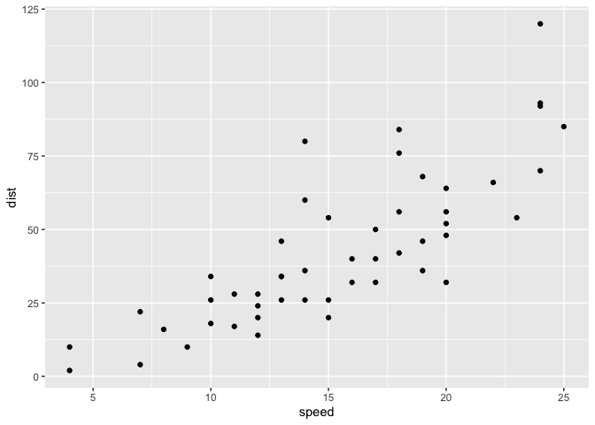
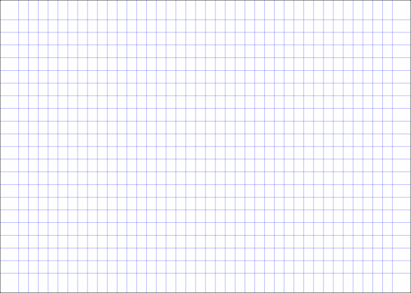

- [ggram](#ggram)
- [What’s inside:](#whats-inside)
- [`StatCode` & `StatCodeLineNumbers`](#statcode--statcodelinenumbers)
- [`code_file_to_code_df`](#code_file_to_code_df)
- [`stamp_notebook`](#stamp_notebook)
  - [ggram with patchwork](#ggram-with-patchwork)
  - [`clearhistory()` (experimental, not
    exported)](#clearhistory-experimental-not-exported)
- [Minimally package](#minimally-package)
  - [ggram table](#ggram-table)

<!-- README.md is generated from README.Rmd. Please edit that file -->

# ggram

<!-- badges: start -->

[](https://lifecycle.r-lib.org/articles/stages.html#experimental)
<!-- badges: end -->

`ggram` explores a method for creating a *quick* code-output
side-by-side for sharing bite-sized how-tos. The specific motivation is
to easily feature ggplot2 extenders work - which so often *transform*
user experience.

We’re in the proof-of-concept phase (expect fragility), but the idea is:

1)  clear history.
2)  execute plot code.
3)  combine plot code (new history) and plot output w/ patchwork (code
    just an annotation).

Thanks to [ggplot2 extenders
discussions](https://github.com/ggplot2-extenders/ggplot-extension-club/discussions/86)
for ideas - there are more ideas there that deserve further exploration
and may make the implementation better.

Install development version:

``` r
remotes::install_github("EvaMaeRey/ggram")
```

The following should be done in an interactive session:

``` r
library(ggplot2)
library(ggram)

###
# clear history with your IDE
###

ggplot(cars) + 
  aes(speed, dist) + 
  geom_point() + 
  geom_smooth() #<<

ggram("This is a ggram.") # this must be on a single line at this early development stage.
```


Notes: ggram::ggram() fails given the string replacement in the current
implementation…

``` r
library(tidyverse)
```

``` r
clearhistory <- function() {
  
  temp <- tempfile()
  write("", file = temp)
  loadhistory(temp)
  unlink(temp)
  
}
```

# What’s inside:

# `StatCode` & `StatCodeLineNumbers`

<details>

``` r

# readLines(temp) |> flipbookr:::code_parse()

#' @importFrom dplyr mutate group_by filter row_number
#' @importFrom stringr str_remove str_split str_detect
#' @importFrom tidyr unnest

compute_panel_code <- function(data, scales){
  
 data |>
    mutate(row = row_number()) |> 
    mutate(is_highlighted = str_detect(.data$code, "#<<")) |> 
    mutate(code = str_remove(.data$code, "#<<")) |>
    mutate(code = str_remove(.data$code, "^#$")) |>
    mutate(code = str_split(.data$code, "")) |>
    unnest(code) |>
    group_by(row) |> 
    mutate(x = row_number()) |>
    mutate(is_character = .data$code != " ") |>
    mutate(is_code = cumsum(.data$is_character) |> as.logical()) |>
    filter(.data$is_code) |>
    mutate(label = .data$code)
  
}


compute_panel_code_line_numbers <- function(data, scales){
  
 data |>
    mutate(row = row_number()) 
  
}

#' @importFrom ggplot2 ggproto aes after_stat Stat
StatCode <- ggproto("StatCode", Stat,
                    compute_panel = compute_panel_code,
                    default_aes = aes(fill = after_stat(is_highlighted),
                                      y = after_stat(row))
                    )

#' @importFrom ggplot2 ggproto aes after_stat Stat
StatCodeLineNumbers <- ggproto("StatCodeLineNumbers", Stat,
                    compute_panel = compute_panel_code_line_numbers,
                    default_aes = aes(y = after_stat(row),
                                      x = after_stat(-0.5),
                                      hjust = after_stat(1),
                                      label = after_stat(row))
                    )
```

</details>

# `code_file_to_code_df`

``` r
code_file_to_code_df <- function(filepath = ".Rhistory"){
  
  readLines(filepath) |> 
    paste(collapse = "\n") |> 
    styler::style_text() |> 
    as.character() |>
    data.frame(code = _) |>
    filter(!stringr::str_detect(code, "^ggram.+"))
  
}
```

``` r
# ggram:::clearhistory()

ggplot(cars) + 
  aes(speed, dist) + 
  geom_point()
```



``` r

code_file_to_code_df() |> 
  compute_panel_code()
#> # A tibble: 5,672 × 7
#> # Groups:   row [209]
#>    code    row is_highlighted     x is_character is_code label
#>    <chr> <int> <lgl>          <int> <lgl>        <lgl>   <chr>
#>  1 g         1 FALSE              1 TRUE         TRUE    g    
#>  2 g         1 FALSE              2 TRUE         TRUE    g    
#>  3 p         1 FALSE              3 TRUE         TRUE    p    
#>  4 l         1 FALSE              4 TRUE         TRUE    l    
#>  5 o         1 FALSE              5 TRUE         TRUE    o    
#>  6 t         1 FALSE              6 TRUE         TRUE    t    
#>  7 (         1 FALSE              7 TRUE         TRUE    (    
#>  8 c         1 FALSE              8 TRUE         TRUE    c    
#>  9 a         1 FALSE              9 TRUE         TRUE    a    
#> 10 r         1 FALSE             10 TRUE         TRUE    r    
#> # ℹ 5,662 more rows

code_file_to_code_df() |>
  ggplot() + 
  aes(code = code) + 
  geom_text(stat = StatCode) + 
  geom_tile(stat = StatCode, alpha = .2) + 
  scale_y_reverse()
```


# `stamp_notebook`

Only one style currently is supported for the code visual.

``` r

stamp_notebook <- function(){
  
  list(
    
    theme_void(),
    theme(plot.background = element_rect(fill = alpha("whitesmoke", .1))),
    scale_y_reverse(limits = c(-1, 20)),
    # coord_equal(),
    scale_x_continuous(limits = c(-3, 35)),
    annotate("rect", xmin = -Inf, xmax = 0, ymin = -Inf, ymax = Inf, 
             fill = alpha("grey90", .1)),
    geom_vline(xintercept = 0, color = "darkred") ,
    geom_hline(yintercept = 1:29 + .5, color = "blue", linewidth = .2, alpha = .5),
    NULL
  )
  
}

stamp_punched_holes <- function(){
  
   list(
    annotate("point", x = -1.5, y = c(1,9,17) + .25, color = "white", size = 5) ,
    annotate("point", x = -1.5, y = c(1,9,17) + .25, shape = 21, 
             alpha = .3, size = 5, fill = "grey92")
   )
  
}


stamp_graph_paper <- function(){
  
  list(
    
    theme_classic(),
    theme(plot.background = element_rect(fill = alpha("whitesmoke", .1))),
    annotate(geom = "segment", x = I(-3:23/20), xend = I(-3:23/20), y = I(-.2), yend = I(1.1), color = "blue", alpha = .15, linewidth = .2) ,
    annotate(geom = "segment", y = I(-3:23/20), yend = I(-3:23/20), x = I(-.2), xend = I(1.1),  color = "blue", alpha = .15,  linewidth = .2),
    NULL,  
    coord_cartesian(clip = "off")
  )
  
}
```

``` r
ggplot() + 
  stamp_notebook() + 
  stamp_punched_holes()
```


``` r

ggplot(cars) + 
  stamp_graph_paper() + 
  aes(speed,dist) + 
  geom_point()
```



``` r
library(ggram)
library(tidyverse)

library(ggplot2)

ggram:::clearhistory()

#' Get ready for Oct 3rd
#'
theme_grey(
  accent = "darkorange"
  ) |>
  set_theme()
#'
ggplot(cars, 
       aes(speed, dist)) + 
  geom_point() + 
  geom_smooth(se = F)

ggram()
```

``` r

code_df_to_code_plot <- function(code_df){
  
  code_df |>
  ggplot() +
    aes(code = code) +
    stamp_notebook() +
    geom_tile(stat = StatCode) + 
    scale_fill_manual(values = c(alpha("grey90",.4), alpha("yellow", .4)), 
                      breaks = c(FALSE, TRUE)) +
    geom_text(stat = StatCode, alpha = .7, family = "mono") +
    geom_text(stat = StatCodeLineNumbers, family = "mono") +
    theme(legend.position = "none") + 
    stamp_punched_holes()
  
}
```

``` r
code_file_to_code_df() |>
  code_df_to_code_plot()
```


## ggram with patchwork

``` r
#' @export
ggram <- function(title = NULL, widths = c(1,1), style_output = F, ...){
  
  temp <- tempfile()
  savehistory(file = temp)

  plot <- last_plot()
  
  code_plot <- code_file_to_code_df(temp) |>
    code_df_to_code_plot()
  
  if(style_output){style = stamp_graph_paper()}else{style = NULL}
  
  patchwork::free(code_plot) + plot + style + patchwork::plot_layout(widths = widths) +
    patchwork::plot_annotation(title = title, ...) & 
    theme(plot.background = element_rect(colour = "black", linewidth = .05))
  
}

#' @export
ggram_df_output <- function(title = NULL, widths = c(1.1,1), ...){
  
  temp <- tempfile()
  savehistory(file = temp)

  readLines(temp)[!stringr::str_detect(readLines(temp), "ggram")] |>  
  paste(collapse = "\n") ->
    code
  
  code_plot <- code_file_to_code_df(temp) |>
    code_df_to_code_plot()
  
  eval(parse(text = code)) -> output
  
  
  patchwork::free(code_plot) + gt::gt(output) + patchwork::plot_layout(widths = widths) +
  patchwork::plot_annotation(title = title, ...) & 
  theme(plot.background = element_rect(colour = "black", linewidth = .05))
    
}

ggram_tp_output <- function(title = NULL, widths = c(1,1), ...){
  
  temp <- tempfile()
  savehistory(file = temp)

  readLines(temp)[!stringr::str_detect(readLines(temp), "ggram")] |>  
  paste(collapse = "\n") ->
    code
  
  code_plot <- code_file_to_code_df(temp) |>
    code_df_to_code_plot()
  
  eval(parse(text = code)) |> tidypivot::collect() -> output
  
  
  patchwork::free(code_plot) + gt::gt(output) + patchwork::plot_layout(widths = widths) +
  patchwork::plot_annotation(title = title, ...) & 
  theme(plot.background = element_rect(colour = "black", linewidth = .05))
    
}


#' @export
ggram_text_output <- function(title = NULL, widths = c(1,1), ...){
  
  temp <- tempfile()
  savehistory(file = temp)

  readLines(temp)[!stringr::str_detect(readLines(temp), "ggram")] |>  
  paste(collapse = "\n") ->
    code
  
  code_plot <- code_file_to_code_df(temp) |>
    code_df_to_code_plot()
  
  capture.output(eval(parse(text = code))) -> output
  
  output |>
    data.frame(code = _) |>
      dplyr::mutate(row_number = dplyr::row_number()) |>
      ggplot() + 
      aes(x = 1, 
          y = row_number, 
          label = code) +
      geom_text(hjust = 0, family = "mono") +
    stamp_notebook() ->
    text_output_plot
  
  patchwork::free(code_plot) + text_output_plot + patchwork::plot_layout(widths = widths) +
  patchwork::plot_annotation(title = title, ...) & 
  theme(plot.background = element_rect(colour = "black", linewidth = .05))
    
}
```

## `clearhistory()` (experimental, not exported)

``` r
clearhistory <- function() {
  
  temp <- tempfile()
  write("", file = temp)
  loadhistory(temp)
  unlink(temp)
  
}
```

``` r
ggram:::clearhistory()

library(tidyverse)
#
ggplot(cars) + 
  aes(speed, dist) + 
  geom_point() + 
  geom_smooth() #<<

ggram()

ggsave(filename = "a_ggram.png", width = 8, height = 5)
```

``` r
library(ggram)
ggram:::clearhistory()

library(ggsurvfit)
#
df_colon |>
  survfit2(Surv(time, status) ~ 
             surg, 
           data = _) |>
  ggsurvfit(linewidth = 1) +
  add_confidence_interval() +
  add_quantile(y_value = 0.6) +
  scale_ggsurvfit()


ggram("30DayChartChallenge2024, Day #7: Hazards")
```

``` r
knitr::include_graphics("a_ggram.png")
```


# Minimally package

``` r
devtools::create(".")
```

``` r
usethis::use_package("ggplot2")
usethis::use_package("patchwork")
usethis::use_package("stringr")
usethis::use_package("styler")
usethis::use_package("dplyr")
usethis::use_package("tidyr")
usethis::use_package("magick")


# knitrExtra::chunk_names_get()
knitrExtra::chunk_to_dir(c("clearhistory", "StatCode", "stamp_notebook", "ggram", "code_file_to_code_df", "code_df_to_code_plot", "gif_from_ggplots"))
```

``` r
devtools::document()
devtools::check(".")
devtools::install(pkg = ".", upgrade = "never") 
```

``` r
# knitr::knit_exit()
```

#### even more experimental

## ggram table

``` r


ggram:::clearhistory()

cars |> 
  head()

ggram_df_output()

geom_mean <- function(se = TRUE) {
  list(
    stat_summary(fun = "mean", geom = "bar", fill = "grey70"),
    if (se) 
      stat_summary(fun.data = "mean_cl_normal", geom = "errorbar", width = 0.4)
  )
}

geom_mean1 <- function(se = TRUE) {
  c(
    stat_summary(fun = "mean", geom = "bar", fill = "grey70"),
    if (se) 
      stat_summary(fun.data = "mean_cl_normal", geom = "errorbar", width = 0.4)
  )
}

identical(geom_mean, geom_mean1)

library(ggplot2)
p1 <- ggplot(mpg, aes(drv, cty)) + geom_mean()
p2 <- ggplot(mpg, aes(drv, cty)) + geom_mean1()

p2$layers
p1$mapping

identical(p1, p2)


library(tidyverse)
library(ggsoiltexture)

tibble(sand = 33.3,
       silt = 33.3, 
       clay = 33.4) |>
  ggsoiltexture() + 
  geom_point(aes(color = sand)) + 
  coord_equal() + 
  scale_color_viridis_c() + 
  NULL
```

``` r
ggram:::clearhistory()

library(tidypivot)
tidytitanic::passengers |>
  ggtable() |>
  set_rows(sex) |>
  set_cols(survived) |>
  set_percent() |>
  set_within(sex)


ggram_tp_output()


ggram:::clearhistory()


p0 <- ggplot(data = diamonds) +
  aes(x = cut,
      fill = clarity) +
  geom_bar() + 
  labs(title = "Each length is the proportion of the whole")

p0

ggram()

ggram:::clearhistory()


p0 + 
  aes(y = after_stat(count) / 
       sum(after_stat(count)))

ggram()


ggram:::clearhistory()

diamonds |>
  ggplot() +
  aes(x = cut, fill = color) +
  geom_bar(position = "fill") + 
  labs(title = "Lengths show the within-cut proportions")

library(tidyverse)
set_theme()
library(ggram)
ggram:::clearhistory()


tribble(~platform, ~ num_steps, 
         "LinkedIn", 8,
         "Other Platforms", 2) |>
  ggplot() +
  aes(x = platform, y = num_steps) +
  geom_col() + #<< # contrast big small
  labs(title = "Number of steps required to\nshare media by platform") + 
  labs(x = NULL, y = NULL)


ggram("#30DayChartChallenge, Day 4 - #BigOrSmall")

gapminder::gapminder |>
  filter(year == 2002) ->
gapminder_2002
ggram:::clearhistory()

library(ggcirclepack) #<< 
ggplot(data = gapminder_2002) +
  aes(id = country,
      area = pop,
      colour = continent) +
  geom_circlepack() + #<<
  geom_circlepack_text() + #<<
  theme(legend.position = "none") + 
  coord_equal()


ggram("#30DayChartChallenge, #Day3 - #Circular", subtitle = "With ggplot2 extension github.com/EvaMaeRey/ggcirclepack")

ggsave("ForLI.png")

library(ggplot2)
```

``` r
ggplot(data = mtcars) + # 'I'd get a dataset...' 
  aes(x = wt,  # 'I want to put this on the x-axis' 
      y = mpg) + # 'Let's put this on the y-axis'
  geom_point() + # 'Put some points here'
  geom_smooth() + # 'Draw a line'
  facet_wrap(vars(cyl)) # 'Break it up by this variable'
```


``` r
library(tidyverse)
compute_panel_comment <- function(data, scales){
  
 data |>
    tidyr::separate(code, into = c("code", "comment"), sep = "#") |>
    mutate(row = row_number()) |> 
    mutate(nchar_code = nchar(.data$code))
    
  
}

StatComment <- ggproto("StatComment", Stat,
                       compute_panel = compute_panel_comment,
                       default_aes = 
                         aes(y = after_stat(row),
                             label = after_stat(comment) |>
                                           str_wrap(15),
                             x = after_stat(ifelse(row %% 2, 0-2, 20 + 2)),
                             hjust = after_stat(ifelse(row %% 2,1.2, -.2))
                             ))


compute_panel_code_w_comment <- function(data, scales){
  
 data |>
    tidyr::separate(code, into = c("code", "comment"), sep = "#") |>
    mutate(row = row_number()) |> 
    mutate(code = str_split(.data$code, "")) |>
    unnest(code) |>
    group_by(row) |> 
    mutate(x = row_number()) |>
    mutate(is_character = .data$code != " ") |>
    mutate(is_code = cumsum(.data$is_character) |> as.logical()) |>
    filter(.data$is_code) |>
    mutate(label = .data$code)
  
}

# knitrExtra::chunk_code_get("hadley") |> 
#   data.frame(code = _) |>
#   compute_panel_code_w_comment()


StatCodeRemoveComment <- ggproto("StatCodeRemoveComment", Stat,
                       compute_panel = compute_panel_code_w_comment,
                       default_aes = aes(y = after_stat(row)))
```

``` r
library(ggplyr)
knitrExtra::chunk_code_get("hadley") |> 
  data.frame(code = _) |>
  ggplot() + 
  aes(code = code) + 
  geom_text(stat = StatCodeRemoveComment,
            family = "mono",
            size = 8) + 
  geom_tile(stat = StatCodeRemoveComment,
            fill = alpha("slateblue", .1)) + 
  geom_label(stat = StatComment, 
             label.padding = unit(.2, "in"),
             label.r = unit(.2, "in"),
             size = 3.5
             ) + 
  geom_label(stat = StatComment,
             aes(label = after_stat(row))) +
  geom_text(stat = StatCodeLineNumbers,
            size = 7, alpha = .3) +
  scale_y_reverse() + 
  coord_cartesian(expand = T, 
                  xlim = c(-10, 30),
                  ylim = c(0, 20)) + 
  theme_void(ink = "slateblue",
             paper = "whitesmoke",
             base_size = 15) +
  theme(plot.margin = margin(10,10,10,10)) +
  geom_vline(xintercept = 0, alpha = .3) +
  labs(title = "ggplot2: transcriber of envisioned plots\n") +
  labs(subtitle = "'In my head I could very clearly kind of picture...'") +
  data_filter(row_number() == 0) + intercept() +
  data_refilter(row_number() == 1) + intercept() +
  data_refilter(row_number() %in% 1:2) + intercept() +
  data_refilter(row_number() %in% 1:3) + intercept() +
  data_refilter(row_number() %in% 1:4) + intercept() +
  data_refilter(row_number() %in% 1:5) + intercept() + 
  data_refilter(row_number() %in% 1:6) + intercept() + 
  annotate(geom = "label", linewidth = 0, label = 
  "'And then, like, getting that vision out of my head, 
  and into reality, [was] just really, really hard. 
  Just, like, felt harder than it should be. Like, 
  there's a lot of custom programming involved. 
           
  I just wanted to say, like, you know, this is what
  I'm thinking, this is how I'm picturing this plot. 
  Like, you're the computer 'Go and do it'....  
           
  And I'd also been reading about the Grammar of 
  Graphics by Leland Wilkinson, I got to meet 
  him a couple of times and ... I was, like, 
  this book has been, like, written for me.'" ,
            x = I(.35), y = I(.32), size = 5) + ggplyr::intercept() + 
  labs(caption = "Hadley Wickham on The Data Wranglers Podcast") + intercept() 
```


``` r

ggsave(filename = "transcriber_of_imagined_plots.png", width = 8,height = 8)
```

``` r
gif_from_ggplots <- function(plots, gif_output_path = "temp.gif"){
  
  plot_nums <- 1:length(plots) 
  plot_files <- paste("temp", plot_nums |> 
                        stringr::str_pad(pad = "0", width = 2), ".png")
  
  for(i in plot_nums){
    
    ggplot2::ggsave(plot_files[i], plot = plots[[i]])
    
  }
  
  image_list <- lapply(plot_files, magick::image_read)
  frames <- magick::image_join(image_list)
  gif <- magick::image_animate(frames, fps = 2, optimize = TRUE) # 1 frame per second
  magick::image_write(gif, path = gif_output_path)
  cat(paste("GIF saved to:", gif_output_path, "\n"))

}
```

``` r
library(ggplyr)
ggplot(cars) + intercept() + 
  aes(speed) + intercept() + 
  geom_histogram() + intercept()
```


``` r

gif_from_ggplots(list(p1, p2, p3))
#> GIF saved to: temp.gif
```

    library(patchwork)
    (p1 + p2) /
      (p3 + p4) /
      (p5 + plot_spacer())
      
    ggsave("p1.pdf", p1, height=8, width=8)
    ggsave("p2.pdf", p2, height=8, width=8)
    ggsave("p3.pdf", p3, height=8, width=8)
    ggsave("p4.pdf", p4, height=8, width=8)
    ggsave("p5.pdf", p5, height=8, width=8)
    ggsave("p6.pdf", p6, height=8, width=8)
    ggsave("p7.pdf", p7, height=8, width=8)
    ggsave("p8.pdf", p8, height=8, width=8)

    pdf_list <- list.files(pattern = "p\\d", )

    pdftools::pdf_combine(pdf_list, output = "slideshow.pdf")
