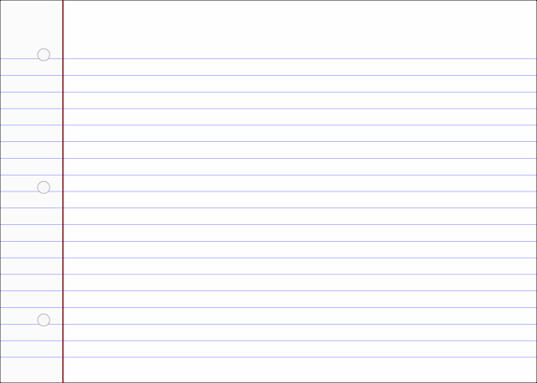

- [ggram](#ggram)
- [What’s inside:](#whats-inside)
  - [`StatCode` & `StatCodeLineNumbers` parse code for disply on a
    ggplot](#statcode--statcodelinenumbers-parse-code-for-disply-on-a-ggplot)
  - [`code_file_to_code_df` parses code or code file to a
    dataframe](#code_file_to_code_df-parses-code-or-code-file-to-a-dataframe)
  - [`stamp_notebook` contains instructions for stamping down a notebook
    paper
    look](#stamp_notebook-contains-instructions-for-stamping-down-a-notebook-paper-look)
- [Styling aspiration for graph-side
  (right-hand-side)](#styling-aspiration-for-graph-side-right-hand-side)
  - [`code_df_to_code_plot()` prepares
    df](#code_df_to_code_plot-prepares-df)
  - [`ggram:::clearhistory()` lets you clear your history using code,
    but you can also do this in your
    IDE](#ggramclearhistory-lets-you-clear-your-history-using-code-but-you-can-also-do-this-in-your-ide)
  - [`ggram()` and friends assemble meta plots containing a plot that
    shows code and the output, stitched together with
    patchwork](#ggram-and-friends-assemble-meta-plots-containing-a-plot-that-shows-code-and-the-output-stitched-together-with-patchwork)
    - [helpers](#helpers)
    - [user-facing ggram and friends](#user-facing-ggram-and-friends)
- [Minimally package](#minimally-package)

<!-- README.md is generated from README.Rmd. Please edit that file -->

# ggram

<!-- badges: start -->

[](https://lifecycle.r-lib.org/articles/stages.html#experimental)
<!-- badges: end -->

`ggram` explores a method for creating a *quick* code-output
side-by-side for sharing bite-sized how-tos. The specific motivation is
to easily feature ggplot2 extenders work - which so often *transform*
user experience.

We’re in the proof-of-concept phase (expect fragility), but the idea is:

1)  clear history.
2)  execute plot code.
3)  combine plot code (new history) and plot output w/ patchwork (code
    just an annotation).

Thanks to [ggplot2 extenders
discussions](https://github.com/ggplot2-extenders/ggplot-extension-club/discussions/86)
for ideas - there are more ideas there that deserve further exploration
and may make the implementation better.

Install development version:

``` r
remotes::install_github("EvaMaeRey/ggram")
```

The following should be done in an interactive session:

``` r
library(ggram)

###
# clear history with your IDE
###

library(ggplot2)
#
ggplot(cars) + 
  aes(speed, dist) + 
  geom_point() + 
  geom_smooth() #<<

ggram("This is a ggram.") # this must be on a single line at this early development stage.
```


Notes: ggram::ggram() fails given the string replacement in the current
implementation…

``` r
library(tidyverse)
```

# What’s inside:

## `StatCode` & `StatCodeLineNumbers` parse code for disply on a ggplot

<details>

``` r

# readLines(temp) |> flipbookr:::code_parse()

#' @importFrom dplyr mutate group_by filter row_number
#' @importFrom stringr str_remove str_split str_detect
#' @importFrom tidyr unnest

compute_panel_code <- function(data, scales){
  
 data |>
    mutate(row = row_number()) |> 
    mutate(is_highlighted = str_detect(.data$code, "#<<")) |> 
    mutate(code = str_remove(.data$code, "#<<")) |>
    mutate(code = str_remove(.data$code, "^#$")) |>
    mutate(code = str_split(.data$code, "")) |>
    unnest(code) |>
    group_by(row) |> 
    mutate(x = row_number()) |>
    mutate(is_character = .data$code != " ") |>
    mutate(is_code = cumsum(.data$is_character) |> as.logical()) |>
    filter(.data$is_code) |>
    mutate(label = .data$code)
  
}


compute_panel_code_line_numbers <- function(data, scales){
  
 data |>
    mutate(row = row_number()) 
  
}

#' @importFrom ggplot2 ggproto aes after_stat Stat
StatCode <- ggproto("StatCode", Stat,
                    compute_panel = compute_panel_code,
                    default_aes = aes(fill = after_stat(is_highlighted),
                                      y = after_stat(row))
                    )

#' @importFrom ggplot2 ggproto aes after_stat Stat
StatCodeLineNumbers <- ggproto("StatCodeLineNumbers", Stat,
                    compute_panel = compute_panel_code_line_numbers,
                    default_aes = aes(y = after_stat(row),
                                      x = after_stat(-0.5),
                                      hjust = after_stat(1),
                                      label = after_stat(row))
                    )
```

</details>

``` r
# for demo purposes only
create_plot_code <- function(){
  
  "library(ggplot2)
  #
  ggplot(cars) + 
  aes(speed, dist) + 
  geom_point()
  "

  }
```

## `code_file_to_code_df` parses code or code file to a dataframe

``` r
code_file_to_code_df <- function(code = NULL, filepath = ".Rhistory"){
  
  if(is.null(code)){code <- readLines(filepath) |> 
    paste(collapse = "\n") }
  
  code |> 
    styler::style_text() |> 
    as.character() |>
    data.frame(code = _) |>
    filter(!stringr::str_detect(code, "^ggram.+"))
  
}
```

``` r
# ggram:::clearhistory()

ggplot(cars) + 
  aes(speed, dist) + 
  geom_point()
```



``` r

create_plot_code() |>
code_file_to_code_df() |> 
  compute_panel_code()
#> # A tibble: 60 × 7
#> # Groups:   row [4]
#>    code    row is_highlighted     x is_character is_code label
#>    <chr> <int> <lgl>          <int> <lgl>        <lgl>   <chr>
#>  1 l         1 FALSE              1 TRUE         TRUE    l    
#>  2 i         1 FALSE              2 TRUE         TRUE    i    
#>  3 b         1 FALSE              3 TRUE         TRUE    b    
#>  4 r         1 FALSE              4 TRUE         TRUE    r    
#>  5 a         1 FALSE              5 TRUE         TRUE    a    
#>  6 r         1 FALSE              6 TRUE         TRUE    r    
#>  7 y         1 FALSE              7 TRUE         TRUE    y    
#>  8 (         1 FALSE              8 TRUE         TRUE    (    
#>  9 g         1 FALSE              9 TRUE         TRUE    g    
#> 10 g         1 FALSE             10 TRUE         TRUE    g    
#> # ℹ 50 more rows


create_plot_code() |>
code_file_to_code_df() |>
  ggplot() + 
  aes(code = code) + 
  geom_text(stat = StatCode) + 
  geom_tile(stat = StatCode, alpha = .2) + 
  scale_y_reverse()
```


## `stamp_notebook` contains instructions for stamping down a notebook paper look

Only one style currently is supported for the code visual.

``` r
stamp_punched_holes <- function(){
  
   list(
    annotate("point", x = -1.5, y = I(c(1,9,17)/20) , color = "white", size = 5) ,
    annotate("point", x = -1.5, y = I(c(1,9,17)/20), shape = 21, 
             alpha = .3, size = 5, fill = "grey92")
   )
  
}


stamp_notebook <- function(vline_color = "darkred", hline_color = "blue", paper_color = alpha("whitesmoke", .1),
                           width = 35,
                           height = 20, punch_holes = T){
  
  punch_base <- annotate("point", x = -1.5, y = I(c(1,9,17)/20) , color = "white", size = 5)
  punch_edge <- annotate("point", x = -1.5, y = I(c(1,9,17)/20), shape = 21, 
             alpha = .3, size = 5, fill = "grey92")
  
  list(
    
    theme_void(),
    theme(plot.background = element_rect(fill = paper_color)),
    scale_y_reverse(limits = c(-1, height)),
    # coord_equal(),
    scale_x_continuous(limits = c(-3, width)),
    annotate("rect", xmin = -Inf, xmax = 0, ymin = -Inf, ymax = Inf, 
             fill = alpha("grey90", .1)),
    geom_vline(xintercept = 0, color = vline_color) ,
    geom_hline(yintercept = 1:29 + .5, color = hline_color, linewidth = .2, alpha = .5),
    if(punch_holes){punch_base}else{NULL},
    if(punch_holes){punch_edge}else{NULL}
    
  )
  
}
```

``` r
ggplot() + 
  stamp_notebook()
```


``` r
stamp_notebook_college_rule <- function(){
  
stamp_notebook(width = 40,
               height = 25)
  
}


stamp_typed_page <- function(){
  
stamp_notebook(vline_color = "darkolivegreen", 
               hline_color = alpha("lightgrey", .1), 
               paper_color = alpha("whitesmoke", .1),
               width = 50,
               height = 30)
  
}


stamp_cornsilk_page <- function(){
  
stamp_notebook(vline_color = alpha("cornsilk2",0), 
               hline_color = alpha("cornsilk2",0), 
               paper_color = alpha("cornsilk2",1),
               width = 50,
               height = 30)
  
}


stamp_legal_pad <- function(...){
  
  list(
stamp_notebook(vline_color = "darkred", 
               hline_color = "blue", 
               paper_color = alpha("yellow", .2),
               width = 40,
               height = 25, ...
               ),
 geom_vline(xintercept = -.2, color = "darkred"))
  
  
}
```

``` r
p1 <- ggplot() + 
  stamp_cornsilk_page()

p2 <- ggplot() + 
  stamp_legal_pad() 

p3 <- ggplot() + 
  stamp_notebook_college_rule()

p4 <- ggplot() + 
  stamp_typed_page()

library(patchwork)
(p1 + p2)/(p3 + p4)
```


# Styling aspiration for graph-side (right-hand-side)

``` r
stamp_graph_paper <- function(){
  
  list(
    
    theme_classic(),
    theme(plot.background = element_rect(fill = alpha("whitesmoke", .1))),
    annotate(geom = "segment", x = I(-3:23/20), xend = I(-3:23/20), y = I(-.2), yend = I(1.1), color = "blue", alpha = .15, linewidth = .2) ,
    annotate(geom = "segment", y = I(-3:23/20), yend = I(-3:23/20), x = I(-.2), xend = I(1.1),  color = "blue", alpha = .15,  linewidth = .2),
    NULL,  
    coord_cartesian(clip = "off")
  )
  
}

ggplot(cars) + 
  stamp_graph_paper() + 
  aes(speed,dist) + 
  geom_point()
```


``` r
library(ggram)
library(tidyverse)

library(ggplot2)

ggram:::clearhistory()
```

## `code_df_to_code_plot()` prepares df

``` r
code_df_to_code_plot <- function(code_df, style = stamp_notebook()){
  
  code_df |>
  ggplot() +
    aes(code = code) +
    geom_tile(stat = StatCode) + 
    scale_fill_manual(values = c(alpha("grey90",.4), alpha("yellow", .4)), 
                      breaks = c(FALSE, TRUE), guide = "none") +
    geom_text(stat = StatCode, alpha = .7, family = "mono") +
    geom_text(stat = StatCodeLineNumbers, family = "mono") +
    theme(legend.position = "none") + 
    style
  
}
```

``` r
create_plot_code() |>
  code_file_to_code_df() |>
  code_df_to_code_plot()
```


## `ggram:::clearhistory()` lets you clear your history using code, but you can also do this in your IDE

``` r
clearhistory <- function(){
  
  temp <- tempfile()
  write("", file = temp)
  loadhistory(temp)
  unlink(temp)
  
}
```

## `ggram()` and friends assemble meta plots containing a plot that shows code and the output, stitched together with patchwork

### helpers

<details>

``` r
get_code <- function(code = NULL){
  
  # 1. get code from history if not provided
  if(is.null(code)){
  
    # 1.a Get code from history
    temp <- tempfile()
    savehistory(file = temp)
  
    # 1.b remove ggram line and collapse
    readLines(temp)[!stringr::str_detect(readLines(temp), "ggram")] |>  
    paste(collapse = "\n")
    
  }else{
    
    code |> paste(collapse = "\n")
    
    }
  
}

specify_code_plot <- function(code, style = stamp_notebook()){
  
  code |> 
    code_file_to_code_df() |>
    code_df_to_code_plot(style = style)
  
}

patch_code_and_output <- function(code_plot, output_plot, widths, title, ...){
  
  print(
  patchwork::free(code_plot) + output_plot + 
  patchwork::plot_layout(widths = widths) +
  patchwork::plot_annotation(title = title, ...) & 
  theme(plot.background = element_rect(colour = "black", linewidth = .05)) 
  )
  
}

specify_textoutput_plot <- function(output){
  
  output |>
    data.frame(code = _) |>
      dplyr::mutate(row_number = dplyr::row_number()) |>
      ggplot() + 
      aes(x = 1, 
          y = row_number, 
          label = code) +
      geom_text(hjust = 0, family = "mono") + 
    stamp_notebook() + 
    stamp_punched_holes()
  
}
```

</details>

### user-facing ggram and friends

``` r
#' @export
ggram <- function(title = NULL, widths = c(1,1), code = NULL, style = stamp_notebook(), ...){
  
  code <- get_code()
  code_plot <- specify_code_plot(code, style = style)
  output <- eval(parse(text = code))
  output_plot <- output
  
  patch_code_and_output(code_plot, output_plot, widths, title, ...)
  
}
```

``` r
ggram:::clearhistory()

library(tidyverse)
#
ggplot(cars) + 
  aes(speed, dist) + 
  geom_point() + 
  geom_smooth() #<<

ggram("Here is my ggram")
```

``` r
ggram_save <- function(..., width = 8, height = 5){
  
  ggsave(..., width = width, height = height)
  
}
```

``` r
ggram_save("man/figures/a_ggram.png") 
```

``` r
knitr::include_graphics("man/figures/a_ggram.png")
```


``` r
#' @export
ggram_df_output <- function(title = NULL, widths = c(1.1,1), code = NULL, style = stamp_notebook(), ...){
  
  code <- get_code(code = code)
  code_plot <- specify_code_plot(code, style = style)
  output <- eval(parse(text = code))
  output_plot <- gt::gt(output)
  
  patch_code_and_output(code_plot, output_plot, widths, title, ...)
    
}
```

``` r
ggram:::clearhistory()

cars |> 
  head()

ggram_df_output()

ggsave(filename = "man/figures/a_ggram_df.png", width = 8, height = 5)
```

``` r
knitr::include_graphics("man/figures/a_ggram_df.png")
```


``` r

"cars |> 
  head()" |>
  ggram_df_output(code = _)
```


``` r
knitr::include_graphics("man/figures/a_ggram_text.png")
```


# Minimally package

``` r
usethis::use_package("ggplot2")
usethis::use_package("patchwork")
usethis::use_package("stringr")
usethis::use_package("styler")
usethis::use_package("dplyr")
usethis::use_package("tidyr")
# usethis::use_package("magick")


knitrExtra::chunk_names_get()
#>  [1] "unnamed-chunk-1"      "unnamed-chunk-2"      "unnamed-chunk-3"     
#>  [4] "unnamed-chunk-4"      "read"                 "unnamed-chunk-5"     
#>  [7] "StatCode"             "unnamed-chunk-6"      "code_file_to_code_df"
#> [10] "unnamed-chunk-7"      "stamp_notebook"       "unnamed-chunk-8"     
#> [13] "unnamed-chunk-9"      "unnamed-chunk-10"     "unnamed-chunk-11"    
#> [16] "unnamed-chunk-12"     "code_df_to_code_plot" "unnamed-chunk-13"    
#> [19] "clearhistory"         "helpers"              "ggram"               
#> [22] "unnamed-chunk-14"     "unnamed-chunk-15"     "unnamed-chunk-16"    
#> [25] "unnamed-chunk-17"     "ggram_df_output"      "unnamed-chunk-18"    
#> [28] "unnamed-chunk-19"     "unnamed-chunk-20"     "unnamed-chunk-21"    
#> [31] "unnamed-chunk-22"     "unnamed-chunk-23"     "unnamed-chunk-24"    
#> [34] "ggram_tp_output"      "unnamed-chunk-25"     "ggram_text_output"   
#> [37] "unnamed-chunk-26"     "unnamed-chunk-27"     "unnamed-chunk-28"    
#> [40] "hadley"               "unnamed-chunk-29"     "unnamed-chunk-30"    
#> [43] "gif_from_ggplots"     "unnamed-chunk-31"
knitrExtra::chunk_to_dir(
  c("clearhistory", 
    "StatCode", 
    "stamp_notebook", 
    "helpers",
    "ggram", "ggram_df_output", 
    "code_file_to_code_df", 
    "ggram_text_output",
    "ggram_tp_output",
    "code_df_to_code_plot"#, 
    # "gif_from_ggplots"
    ))
```

``` r
devtools::document()
devtools::check(".")
devtools::install(pkg = ".", upgrade = "never") 
```

``` r
remove(list = ls())
library(ggram)
library(tidyverse)

ggram:::clearhistory()

"cars" |> 
  ggram::ggram_df_output()
```

``` r
knitr::knit_exit()
```
